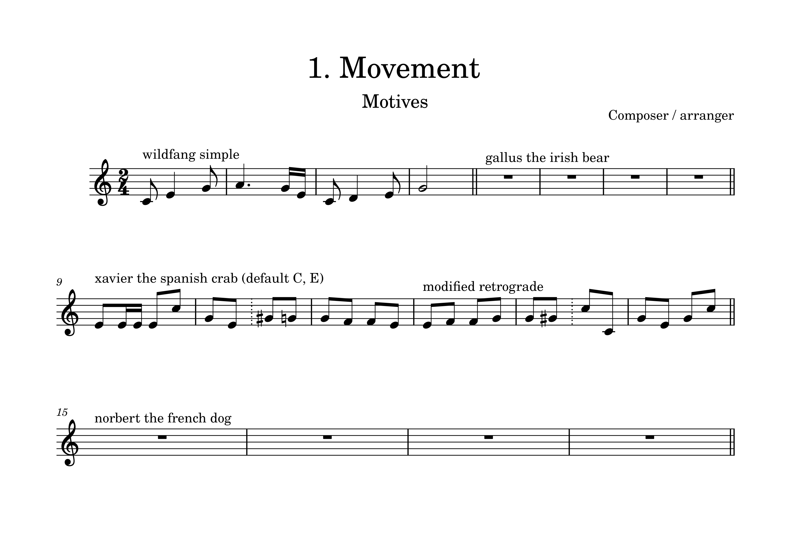

# os-symphony-1

Open Source Symphony

This is an experiment to plan, compose, orchestrate and proof-read an Symphony as a group of contributors. 

# Getting Started

## Prerequisites

You need Muse Score Studio v4.4.3 installed to work with the score files. See https://musescore.org/en.

# Composition Style

- tonal
  - possibility for short now overhelming atonal devitations
  - in the Style of Mendelssohn, Schumann, Schubert, Mozart, Bach, C.P.E. Bach
- for symphony orchestra
  - possibility for a few carrieable additional non standard percussion instruments
  - no electronic instruments
  - playable for semi-professionals
  
# Structure

## 1. Movement - C Major

In a Landscape of Ice and Fire.

- **A Section** a wildfang (wild, free sprited) and simple protagonist 
  - arrives and will then meet three animals
  - all motives appear or are at least hinted at
- **B Section** Gallus the irish bear
- **A.1 Section**
  - short
- **C Section** Xaver the spanish crab
  - a minor accessible, consider andalusian, terrega
  - consider Pasodoble
  - rhythms based on contradanza, tresillo, cinquillo, bele (belair), son montuno/tumbao piano bass, zouk, bachata zouk
  - Laureano Fuentes Matons, Las artes en Santiago de Cuba
- **A.2 Section**
  - short
- **D Section** Norbert the french dog
  - 
- **A.3 Section**
  - closing
  

## 2. Movement (to be announced)

- Défense des cordes contre les entreprises des cuivres et les prétentions des bois

## 3. Movement

- Scherzo based on Dvořák: Moravian Duets, Op. 32, Bändl, Ringlein

## 4. Movement (to be announced)

# Roadmap

- [ ] Templates and Folder Structure
  - [ ] Instumentation
  - [ ] Piano Reductions
  - [ ] Issue Templates
  - [ ] Pipeline for Audio Samples of Motives and Sections (Piano + Orchestra)
- [ ] Describe Composition Style Guide 
- [ ] Finish Piano Reduction Parts for First Movement
- [ ] Finish Orchestration for First Movement

# Contributing

Make sure you understand that you are contributing to a 
project that uses the MIT License and the consequences.

*Areas of Contribution:*
- Planning the Structure / Moderating Issues / Documenting
  - please try to get in contact with me
- Composing
  - as issues or merge requests
  - if you want to start a new Section, please try to lock/reserve it for you via issue to avoid conflicts
  - try to do small contributions, just a theme or just a variation/continuation
  - your work might be replaced
- Orchestrating
  - as issues or merge requests
  - your work might be replaced
- Pointing out or Fixing Errors (possibly only for the instrument you know best)
  - as issues or merge requests 
